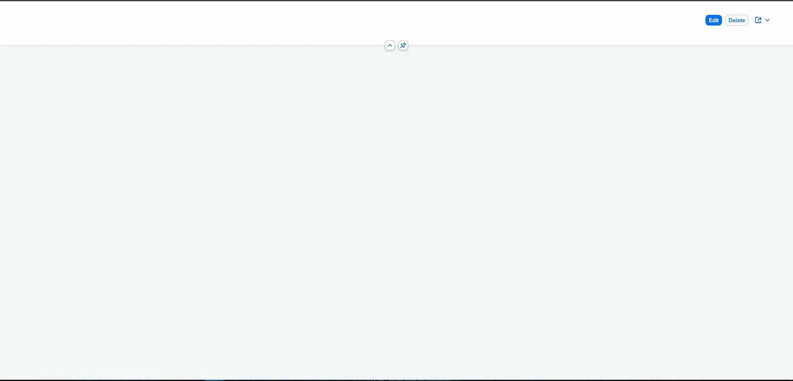
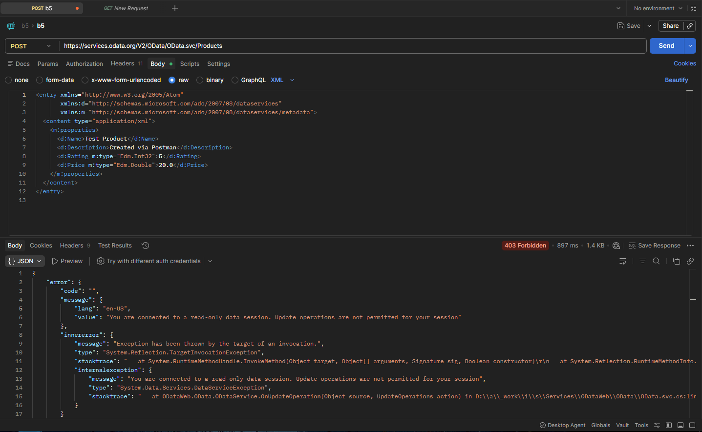
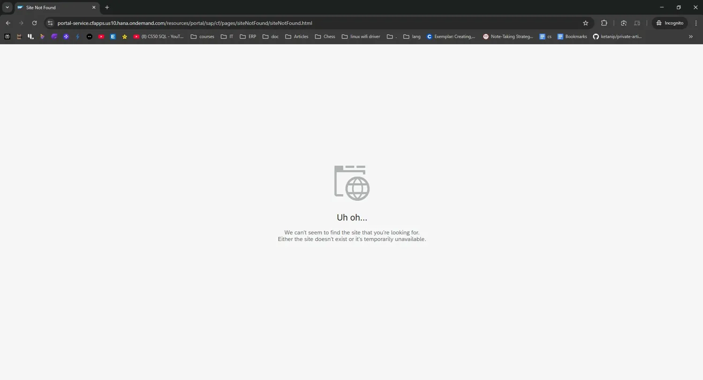
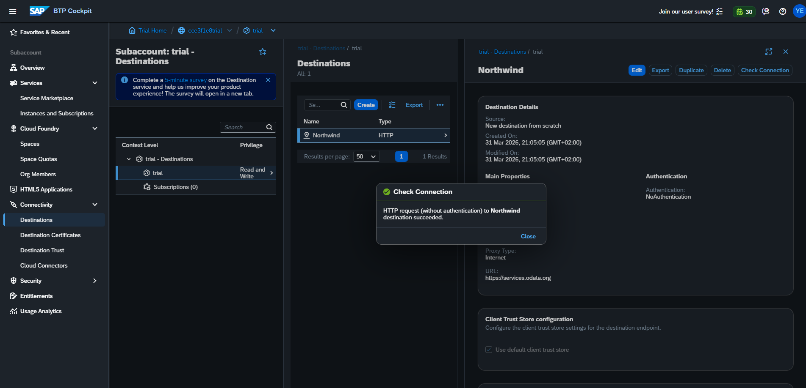
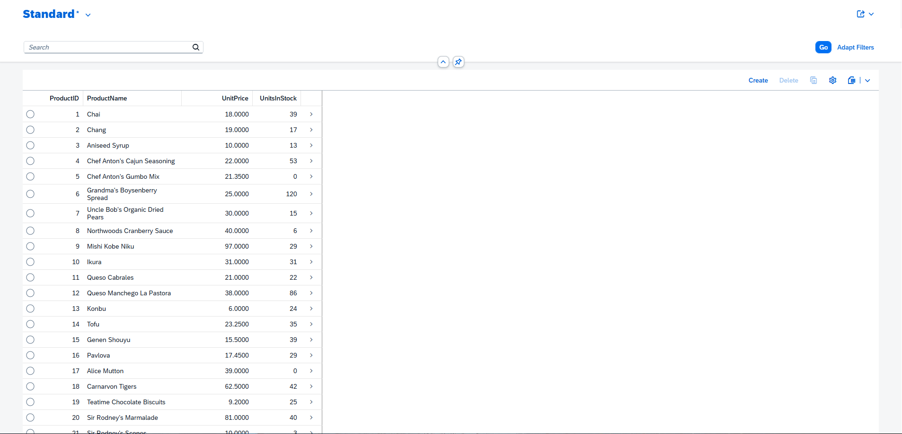
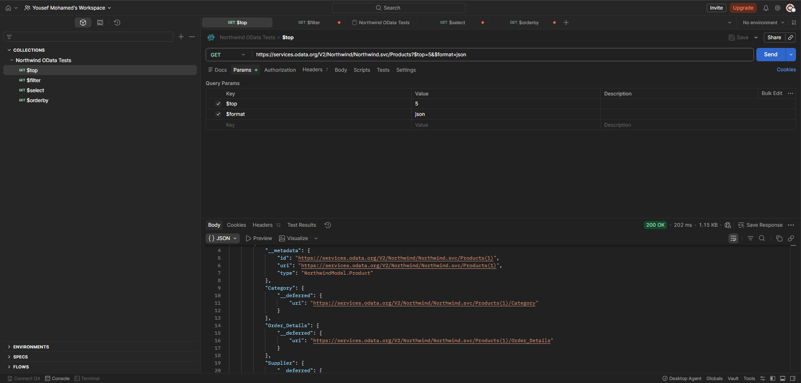
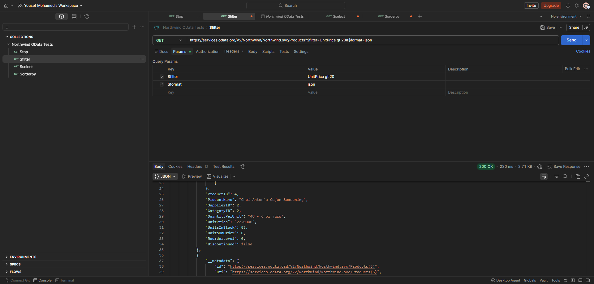
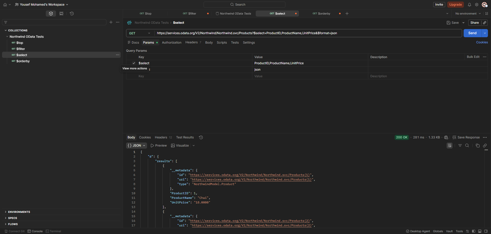
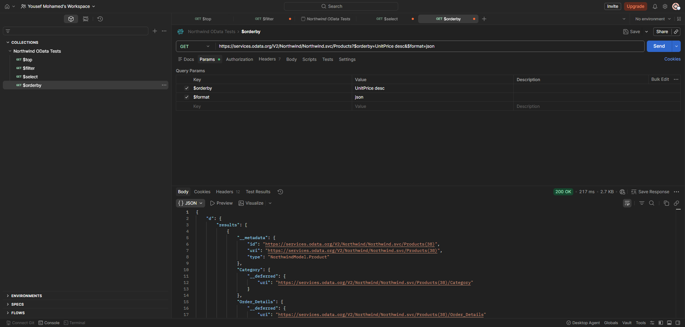
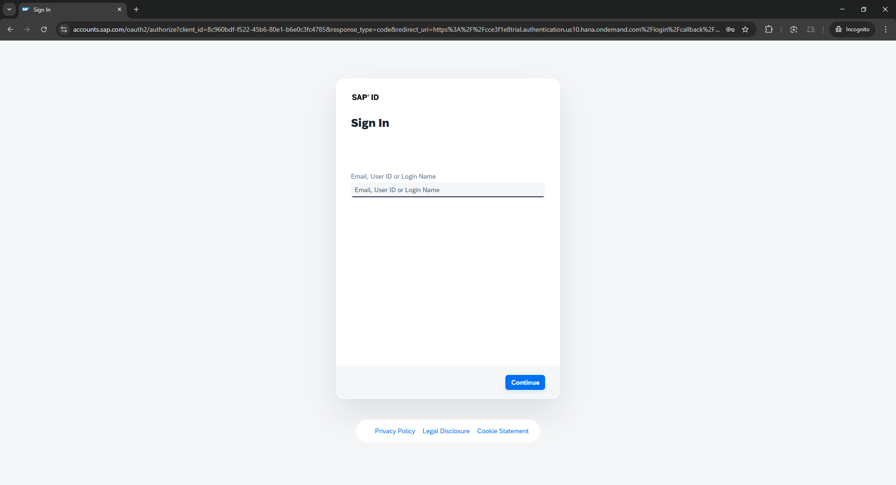

# Northwind Products - SAP Fiori Application

A SAP Fiori Elements List Report application built using SAP Business Application Studio (BAS), connected to the public Northwind OData service via an SAP BTP destination. The app displays product data including ProductID, ProductName, UnitPrice, and UnitsInStock, and is deployed to SAP BTP Cloud Foundry using MTA build tools.

## Architecture Overview

- **SAP BTP Destination**: Configured in BTP Cockpit to point to the Northwind OData service (https://services.odata.org). This acts as a secure proxy so BAS and the deployed app can consume the external OData service without exposing credentials.
- **SAP Business Application Studio (BAS)**: Used to scaffold and develop the Fiori Elements List Report app using the Fiori generator wizard. BAS runs on Cloud Foundry and connects to the destination service during development.
- **Cloud Foundry**: The runtime environment within SAP BTP where the application is deployed. The MTA deployment packages the app into the HTML5 Application Repository, which serves it via the managed application router provided by SAP Build Work Zone.

## Setup Instructions
 
1. Log in to [SAP BTP Cockpit](https://cockpit.hanatrial.ondemand.com) and navigate to your subaccount.
2. Go to **Connectivity → Destinations** and create a new destination:
   - **Name**: `Northwind`
   - **URL**: `https://services.odata.org`
   - **Type**: HTTP
   - **Authentication**: NoAuthentication
   - **Proxy Type**: Internet
   - **Additional Properties**: `WebIDEEnabled = true`, `WebIDEUsage = odata_gen`, `HTML5.DynamicDestination = true`
3. Subscribe to **SAP Business Application Studio** from the Service Marketplace.
4. Subscribe to **SAP Build Work Zone, standard edition** from the Service Marketplace.
5. Assign the following role collections to your user:
   - `Business_Application_Studio_Developer`
   - `Launchpad_Admin`
6. Launch BAS and create a new **SAP Fiori** Dev Space.
7. Open the project wizard → select **List Report Page** template.
8. Set Data Source to **Connect to an OData Service**.
9. Enter OData URL: `https://services.odata.org/V2/Northwind/Northwind.svc/`
10. Select **Products** as the Main Entity, Navigation Entity: **None**, Table Type: **Responsive**.
11. Set namespace to `com.intern.northwindapp` and title to `Northwind Products`.
12. Click **Finish** to generate the project.
13. Add UI annotations in `webapp/annotations/annotation.xml` for columns and Object Page fields.
14. Run `npm start` to preview the application in BAS.

### Deploying to Cloud Foundry
 
```bash
# Install MTA build tool
npm install -g mbt
 
# Login to Cloud Foundry
cf login -a https://api.cf.us10-001.hana.ondemand.com
 
# Build the app
npm run build
 
# Create ZIP for deployment
mkdir -p resources
cd dist && zip -r ../resources/data.zip . && cd ..
 
# Build MTA archive
mbt build -t mta_archives/
 
# Deploy
cf deploy mta_archives/cominternnorthwindappnorthwindproducts_0.0.1.mtar
```
 
## OData Entity Used
 
**Entity Set: Products**
 
The Products entity was selected because it contains several meaningful fields (ProductID, ProductName, UnitPrice, UnitsInStock, QuantityPerUnit, ReorderLevel) that demonstrate a realistic business use case — browsing and reviewing product inventory data. It is also the most commonly used entity in Northwind for Fiori demonstrations.

## Challenges Faced

**Challenge 1 — Invalid OData URL in Fiori Generator**
When entering the OData service URL, the relative path `/V2/Northwind/Northwind.svc/` was rejected with "Invalid URL". The full absolute URL `https://services.odata.org/V2/Northwind/Northwind.svc/` was required.
 
**Challenge 2 — Missing Backend Annotations**
The Northwind service has no backend UI annotations, so the List Report and Object Page rendered blank. This was resolved by manually creating `webapp/annotations/annotation.xml` with `UI.LineItem`, `UI.HeaderInfo`, `UI.FieldGroup`, and `UI.Facets` annotations.
 
**Challenge 3 — Service Name Mismatch in `mta.yaml`**
The `destination-content` module referenced service names that didn't match the actual deployed service instance names. This was resolved by updating the `ServiceInstanceName` values in `mta.yaml` to match the actual service names created by CF.

**Challenge 4 — B4 - Object Page Rendering Blank**
When clicking a product row to navigate to the Object Page, the page loaded successfully (Edit/Delete buttons visible) but rendered blank with no fields displayed. This was caused by missing `UI.FieldGroup` and `UI.Facets` annotations in `annotation.xml`. The issue was resolved by manually adding these annotations to define the Object Page sections and fields. However, due to the BAS preview environment requiring a Fiori Launchpad shell for `ShellUIService`, the Object Page fields did not render correctly in the standalone preview. The Page Map confirmed the Object Page was correctly configured with navigation from the List Report to the Object Page using the Products entity.


**Challenge 5 — B5 - 403 Forbidden response**
A POST request was attempted using Postman against the public OData service. However, the request returned a 403 Forbidden response due to server-side restrictions on write operations. This behavior is expected for publicly hosted demo services with limited write access. The request structure, headers, and body were correctly configured in accordance with OData V2 standards.


**Challenge 6 — B6 - SAP Build Work Zone Access Denied (B6)**
Despite subscribing to SAP Build Work Zone (standard edition) and assigning the `Launchpad_Admin` and `Launchpad_Advanced_Theming` role collections, the Work Zone site manager returned "Access Denied" on every attempt. This appears to be a known limitation of SAP BTP Trial accounts where role propagation can take time or may be restricted. B6 was attempted but could not be fully completed due to this platform-level restriction.


## Bonus Tasks Completed

**B1** Deploy to Cloud Foundry using MTA build tools and `cf deploy`
**B2**  Test OData endpoint via Postman with `$top`, `$filter`, `$select`, `$orderby`
**B3** XSUAA Authentication configured — login prompt on deployed URL.
**B4** Fiori Object Page added — drill-down navigation from List Report.
**B5** OData POST request demonstrated via Postman against writable service.

## Deployed Application URL
https://cce3f1e8trial.launchpad.cfapps.us10.hana.ondemand.com/9db276a2-eeab-4660-af61-56663f191558.cominternnorthwindappnorthwindproducts.cominternnorthwindappnorthwindproducts-0.0.1/index.html

## Screenshots

### Deliverable 2 — Northwind Destination in BTP Cockpit


### Deliverable 3 — Application Running in BAS Preview


### B1 — Deployed Application


 
### B2 — Postman OData Queries




 
### B3 — XSUAA Login Prompt

 
### B4 — Object Page Detail View

 
### B5 — Postman POST Request
